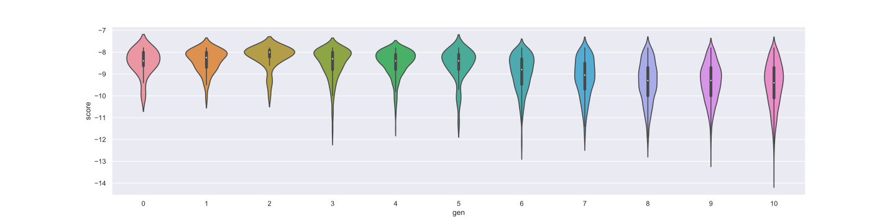

# SARS-CoV-2 Drug Discovery using Genetic Algorithm and Deep Learning

[Here](./img/slides/SLIDES.md) are the slides to our presentation. And [here](https://youtu.be/C3uPkCE-UDQ) is the link to our YouTube presentation.

# Team Details
Team Name: TaoFuFa
1. Quek Yao Jing - [https://github.com/Skyquek](https://github.com/Skyquek)
2. Liew Kok Foo - [https://github.com/Janson-L](https://github.com/Janson-L)
3. Tang Li Ho - [https://github.com/4036tlh](https://github.com/4036tlh)
4. Kwong Tung Nan - [https://github.com/kwongtn](https://github.com/kwongtn) 

# Forkwell Coronavirus Hack: Drug Discovery
This is a submission to the [Forkwell Coronavirus Hack Competition](https://www.forkwell.io/events/forkwell-coronavirus-hack) under the **Drug Discovery** category.

The goal of this category is to create a novel small molecule or find existing drugs on the market that are able to stop or interfere with the coronavirus lifecyle. Therefore, one of the approaches to this is to find out the drugs/ligands that are able to bind with the [coronavirus main protease 6LU7](https://www.rcsb.org/structure/6lu7). 

Several researches and experiments have been conducted and recorded in the [DrugBank paper](https://drugbank.s3-us-west-2.amazonaws.com/assets/blog/COVID-19_Web.pdf). We then use the data to determine our evaluation target. 

Below are samples of existing drugs that have been experimented with the coronavirus binding: 

| Drugs/Ligands        | Binding Score           |
| ------------- |:-------------:|
|   Remdesivir    | -7.4 |
|   Umifenovir    | -6.1     |
|   Favipiravir | -5.6     |
|   Lopinavir | -6.6     |
|   Ritonavir | -6.2     |
|   Galidesivir | -5.6     |
|   Favipiravir | -5.6     |
|   Triazavirin | -5.9     |
|   Chloroquine | -5.6     |
|   Darunavir | -7.2     |
|   TMC-310911 | -8.9     |

Table 1.1 shows the existing drugs with their respective binding score.

# Acknowledgement
Our team would like to thank all parties, including but not limited to the forkwell coronavirus hack organizing team and mentors for giving us the chances to work on this project while contributing to the COVID-19 outbreak. 

No project is done without the support of various parties. As such, we would like to specially shoutout to the following amazing individuals:

- [**Matt O'Connor**](https://github.com/mattroconnor)\
This project is continuous progress from the repository [Deep_Learning_Coronavirus_Cure](https://github.com/mattroconnor/deep_learning_coronavirus_cure) by Matt O Connor who also happened to be our mentor in this hackathon. We would like to thank him for his extensive mentoring and open source coding.

- [**jhjensen2**](https://github.com/jensengroup)\
The [Graph-Based Genetic Algorithm \[GB-GA\]](https://github.com/jensengroup/GB-GA) is one of our main components in this project. We would like to thank him and his team for the repository which enabled us to reduce our time taken to complete the project.  
The details of his work can be found in his paper - ["A graph-based genetic algorithm and generative model/Monte Carlo tree search for the exploration of chemical space"](https://pubs.rsc.org/en/content/articlelanding/2019/SC/C8SC05372C#!divAbstract).

- **Dr. Low Tek Yew**\
We would like to thank Dr. Low Tek Yew for the [extensive introduction to the hackathon](https://www.youtube.com/watch?v=gQ0zSjqi7PU) and the COVID-19 virus characteristics. His explanation of protease and ligand binding is pivotal to our project.  

# Requirements
The requirements are identical to the original repository [mattroconnor/Deep_Learning_Coronavirus_Cure](https://github.com/mattroconnor/deep_learning_coronavirus_cure)

## Docking
### Data Preparation
- [PyRx](https://pyrx.sourceforge.io/)

### Folder Sharding
- [Microsoft PowerShell 5.0 or above](https://docs.microsoft.com/en-us/powershell/?view=powershell-7) 

### Docking
- [Microsoft PowerShell 5.0 or above](https://docs.microsoft.com/en-us/powershell/?view=powershell-7) 
- [AutoDock Vina Binaries](http://vina.scripps.edu/), also included in the ["binding" folder](./scripts/binding).

### Conversion
- [Microsoft PowerShell 5.0 or above](https://docs.microsoft.com/en-us/powershell/?view=powershell-7) 
- [NodeJS](https://nodejs.org/en/)

# How to use
\* You may want to finish reading the repo before starting.
## Initial generation
1. Run 'Initial Network.ipynb' to get generation 0 SMILES.

## For every generation (including initial)
2. Run 'Evaluation and Refinement-localGA.ipynb'

### Sharding the sdf files
3. In PyRx, load the sdf files and minimize the molecules, then export it to pdbqt file format.
1. Copy out the `.pdbqt` files to a seperate folder and run the sharding script (`/scripts/folderSplitter/shard.ps1`).
1. Copy everything from the `/scripts/binding` folder to each generated folder.
1. The folder is ready for distribution.

### Computing the binding affinity
7. For each folder, run `PowerShell` in it and run the `/scripts/binding/binding.ps1` file.
1. The validation results should be in the `output` folder.

### Consolidation
9. When processing is done, consolidate all the files in each output folder, then copy files in`/scripts/conversion` to it.
1. Run `PowerShell` in it and run the `/scripts/conversion/conversion.ps1` file.
1. The compute results would be consolidated in the `results.csv` file of the same folder.

A generation is complete, you may go to `2` to obtain the next gen.

### Post processing (optional, but recommended to do for last gen)
12. Run `Final Results.ipynb` to visualize the data and filter up the best molecule. 
1. A file will be created in `generations/master_results_table_final.csv`. This file can be validated by bioinformatics.

# Introduction
## local-GA
In this project, we introduced a new concept - local Genetic Algorithm (local-GA), an evolutionary computing optimization method. We plan to keep things easy and simple as the [original repository](https://github.com/jensengroup/GB-GA) is well-maintained and is already ready for usage.

Our method utilizes cross-over and mutation to search for the most suitable molecule in the chemical space based on its fitness function.

We implement the local-GA in 2 areas (details in next section):
1. Before Transfer Learning 
1. Before exporting the molecule to the sdf file format
### **Population: The original molecule**
- The initial population depends on the molecules we compute before passing it on to the local-GA. 
- The first local-GA will select of 70 molecules based on `score`, `similarity` and `log(P)`, together with some random selections. 
- In the second local-GA, the validated molecules from the 5000 generated molecule after transfer learning is used.

### **Mating Pool: The molecules we want to pass from generation by generation**
We select the molecules we need from the population to the mating pool based on the fitness function. 

### **Cross-Over: Exchange part of 2 molecules to generate 2 new Molecules**
The system will first randomly select 2 molecules for crossover at ring or non-ring with equal probability. If the two molecules does not have a valid structure for crossover, it will not be used:
- If a ring structure is selected for crossover, we randomly pick one of the edges of the ring 
- If a non-ring structure is selected for crossover, one of the single bonds (not in ring) will be selected randomly.

We then rejoin these broken molecules and combine them to form 2 new molecules. 2 new molecules will be returned from this function.

### **Mutation: Mutate part of a molecule**
The molecule will undergo 7 processes separately and a random position on the molecule will be selected to do mutation by the function based on their requirements:

  - `insert_atom()`\
    A random bond is selected and classified into 3 categories based on their charge: -1, -2, -3, these information are taken into consideration so that the product will have a valid chemical structure.
  - `change_bond_order()`\
    It gives the new molecule a different shape, while having the same atoms as the original.
  - `delete_cyclic_bond()`\
    One of the ring inside the molecule will be removed.
  - `add_ring()`\
    A ring will be added in a single bond between 2 molecules.
  - `delete_atom()`\
    A random ion will be removed.
  - `change_atom(mol)`\
    A random ion is selected and replaced by another molecule with the same charge as it.
  - `append_atom()`\
    An atom will be selected and the number of hydrogen atoms around it will be used to decide the type of inserted ion (if 1 then an ion with charge -1 will be used; if 2 then an ion with charge -2 will be used; etc.). The new atom will replace the hydrogen(s) and form a new molecule.

  After these 7 processes, one of them will be selected and returned if it is valid.

### **Fitness Function**
The fitness function is the evaluation criteria in every generation based on the `log(P)` value. According to ["logP — Making Sense of the Value" by Sanjivanjit K. Bhal](https://www.acdlabs.com/download/app/physchem/making_sense.pdf), the oral administration of drug should be lower than `5` and best between `1.35` and `1.80`.

`log(P)` is used in the pharmaceutical/biotech industries to help understand the behavior of drug molecules in the body. Drug candidates are often screened according to `log(P)` among other criteria, to help guide drug selection and analog optimization. This is because lipophilicity is a major determining factor in a compound’s absorption, distribution in the body, penetration across vital membranes and biological barriers, metabolism and excretion (ADME properties). According to ‘Lipinski’s Rule of 5’ (developed at Pfizer) the `log(P)` of a compound intended for oral administration should be `<5`. A more lipophilic compound:

- Will have low aqueous solubility, compromising bioavailability. If an adequate concentration of a drug cannot be reached or maintained, even the most potent in-vitro substance cannot be an effective drug.
- May be sequestered by fatty tissue and therefore difficult to excrete; in turn leading to accumulation that will impact the systemic toxicity of the substance.
- May not be ideal for penetration through certain barriers. A drug targeting the central nervous system (CNS) should ideally have a `log(P)` value around `2`, for oral and intestinal absorption `1.35–1.8`, while a drug intended for sub-lingual absorption should have a `log(P)` value of `>5`.

Not only does `log(P)` help predict the likely transport of a compound around the body. It also affects formulation, dosing, drug clearance, and toxicity. Though it is not the only determining factor in these issues, it plays a critical role in helping scientists limit the liabilities of new drug candidates.

# Methodology
## Reference Approach - _[mattroconnor/Deep_Learning_Coronavirus_Cure](https://github.com/mattroconnor/deep_learning_coronavirus_cure)_

Global-Generation 0:

1. LSTM-CHEM to train ChEMBL Database
1. From LSTM CHEM, 10k molecules were generated.
1. Validility of molecules were checked.
1. Compute Tanimoto similarity and select 1000 molecules.
1. IDs were given to the 1000 SMILE files, while the HIV and other drugs' SMILE files were added manually.
1. All molecules were saved in the master table and manually checked from PyRX to get the binding affinity.

While each Global-Generation < n, 

7. From the master table (loaded from Global-Generation), we select:
    - 35 molecules based on score
    - 5 molecules based on the similarity
    - 5 molecules based on the weight
    - 5 molecules based on the random mutation
  
8. From the 55 generated molecules, transfer learning is done. 5000 molecules are then generated, and undergo similarity and validation test. 5000 molecules were then generated, validated, checked for similarity and finally added to the master table.

## Our Approach
Global-Generation 0:
1. LSTM-CHEM to train ChEMBL Database
1. From LSTM CHEM, we generate 10k molecules.
1 Validility of molecules were checked.
1. Compute Tanimoto similarity and select 1000 molecules.
1. IDs were given to the 1000 SMILE files, while other drugs' SMILE files were added manually.
1. All molecules were saved in the master table and manually checked from PyRX to get the binding affinity.

While each Global-Generation < n, 

7. From the master table (loaded from Global-Generation), we select the molecules based on the following attributes with respect to the proportions:
    | Attribute | No of Selections (Generations 0-10) | No of Selections (In generations 11 & 12) |
    | --- | :---: | :---: |
    | Score       | 35 | 55 |
    | Similarity  | 10 | 10 |
    | log(P)      | 10 | 65 |
    | Weights     | 5  | 10 |
    | Random      | 5  | 5  |

1. We then pass the obtained molecules the to local-GA to further obtain 10 molecules that have `log(P)` of 1.35-1.80.
1. By using 90 molecules, we perform `transfer learning` to generate 5,000 molecules.
1. We then do validation on the 5000 generated molecules to discard the invalid molecules.
1. 50 extra molecules are then generated using local-GA which has a `log(P)` value of `1.35-1.8`. 
1. The 50 molecules are validated and combined with molecule from `Step 10`.
1. The molecules were then exported to the sdf file format.
1. `PyRX` was used to minimize the energy of the molecules and export the `.sdf` file into `.pdbqt` files.
1. The files were then organized into folders (depending on how many parallel sessions we want to run) using [a PowerShell script](./scripts/folderSplitter/shard.ps1).
1. Binding calculation [relevant files and configurations](./scripts/binding) were copied into each folder and the folders were distributed among our group members.
1. The output files are collected from our group members once its finished processing and compiled into a `.csv` file using [a PowerShell script](./scripts/conversion/conversion.ps1) and [a NodeJS script](./scripts/conversion/convert.js).
1. The results are interpreted and the process starts from `7` until a satisfactory result is achived or when the tester decides to stop.

# Findings and Analysis

At Generations 17, we had obtain 63 molecule, which is ways more than the in generation 12 that hold only 24 molecules. Our chemical table files can be obtained and download at [here](./generations/genfinal.sdf).

Table below shows the first 30 molecules obtained in generation 17: 

|id  |gen|smile                                                                                                                                                   |source           |weight            |logp              |score|score_best|score_avg          |similarity_to_hiv_inhibitors|similarity_to_remdesivir|
|----|---|--------------------------------------------------------------------------------------------------------------------------------------------------------|-----------------|------------------|------------------|-----|----------|-------------------|----------------------------|------------------------|
|AAAQ|17 |FC#Cc1ccccn1                                                                                                                                            |genetic_algorithm|121.11399999999996|1.3601            |-16.6|-16.6     |-16.35             |0.07689491501455571         |0.07498500299940011     |
|AAAY|17 |CC#CC#CC#CC#CC#CC#CC#CC(=O)NC1=CCCC=C1                                                                                                                  |genetic_algorithm|305.33600000000007|1.3802            |-14.7|-14.7     |-12.850000000000001|0.12670192716889236         |0.13097345132743363     |
|AAAK|17 |CC#CC#CC#CC#CC#CC=CC                                                                                                                                    |genetic_algorithm|176.218           |1.5994000000000002|-13.5|-13.5     |-11.933333333333332|0.024906064435589608        |0.02425712553062462     |
|AAAJ|17 |CC#CC#CC#CC#CC#CC#CC#CC#CC#CC#CC#CC#CC#CC#CC#CC#CC#CC#CC#CC#CC#CC#CC#CC#CC#CC#CC#CC(=O)C#CC#CC#CC#CC(=O)C#CC#CC#CC#CC#CC#CC#CC#CC(=O)C1NC(C)(C)c2ccccc21|genetic_algorithm|1182.1359999999988|1.4258000000000008|-13.4|-13.4     |-11.155555555555557|0.31070221013289756         |0.32                    |
|ABQA|12 |CC1C=CC=C(C(=O)Nc2nnnn2N2CCN(C(=O)Nc3nnnnn3)C2=O)c2ccccc2C2=CC=C(C(=O)Nc3nnnnn3)C2c2ccccc2-c2ccccc21                                                    |generated        |815.7789999999997 |2.3371000000000013|-13.3|-13.3     |-12.377777777777778|0.4879430685740983          |0.6809908998988877      |
|AAXQ|16 |Cc1ccc(C(=O)Nc2nnnn2N2C=NN=NN2N2CCN(C(=O)Nc3nnnnn3)C2=O)c2ccccc2c2ccccc2c2ccccc12                                                                       |generated        |696.6560000000003 |3.156620000000001 |-13.2|-13.2     |-12.477777777777778|0.43951490677916066         |0.6015625               |
|AANY|12 |CC1CCC(C(=O)Nc2nnnn2N2CCN(C(=O)Nc3nnnnn3)C2=O)c2ccccc2-c2ccccc2-c2ccccc2-c2ccccc21                                                                      |generated        |693.7320000000002 |4.874400000000004 |-13.1|-13.1     |-11.988888888888889|0.44936439807407236         |0.5851619644723093      |
|ABZK|16 |CC1=CC=C(C(=O)Nc2nnnn2N2C=NN=NN2N2CCN(C(=O)Nc3nnnnn3)C2=O)c2ccc(C#N)cc2-c2ccccc21                                                                       |generated        |645.5680000000001 |0.9895799999999996|-13.1|-13.1     |-11.355555555555554|0.47176375543293386         |0.6702508960573477      |
|ABOS|16 |CC1=CC=CCCC(C(=O)Nc2nnnn2N2C=NN=NN2N2CCN(C(=O)Nc3nnnnn3)C2=O)c2ccccc2-c2ccccc21                                                                         |generated        |662.6390000000002 |2.1545            |-13.1|-13.1     |-11.922222222222222|0.46726537098984033         |0.661025641025641       |
|ABCA|16 |CC1CCCC(C(=O)Nc2nnnn2N2C=NN=NN2N2C=NN=NN2N2CCN(C(=O)Nc3nnnnn3)C2=O)c2ccccc2-c2ccccc21                                                                   |generated        |721.671           |1.4467000000000014|-13.1|-13.1     |-12.4              |0.4741124763967932          |0.6841294298921418      |
|ABFU|12 |CC1C=CCCC(C(=O)Nc2nnnn2N2CCN(C(=O)Nc3nnnnn3)C2=O)c2ccccc2-c2ccccc2-c2ccccc2C1=O                                                                         |generated        |671.6820000000001 |3.4789000000000017|-13.0|-13.0     |-12.211111111111112|0.45617840012510985         |0.6038421599169262      |
|ABLZ|13 |CC1C=CC(C(=O)Nc2nnnn2N2NCN(C(=O)Nc3nnnnn3)C2=O)c2ccccc2-c2ccccc2-c2ccccc2-c2ccccc21                                                                     |generated        |692.7040000000003 |4.112500000000004 |-12.8|-12.8     |-12.088888888888889|0.44184419022206417         |0.5915049816465653      |
|ABAE|13 |CC1C=CCCCC(C(=O)Nc2nnnn2N2CCN(C(=O)Nc3nnnnn3)C2=O)c2ccccc2-c2ccccc2-c2ccccc21                                                                           |generated        |657.6990000000002 |4.1537000000000015|-12.8|-12.8     |-11.622222222222224|0.45377444668594796         |0.5939614783966684      |
|AAPM|11 |CC1C=CC(C(=O)Nc2nnnn2-c2ccccc2C2=CC=C(C(=O)Nc3nnnnn3)C2=O)c2ccccc2-c2ccccc21                                                                            |generated        |609.6100000000002 |3.2311000000000005|-12.8|-12.8     |-11.61111111111111 |0.46226260431847693         |0.6194144838212635      |
|ABNI|13 |CC1C=CCCC(C(=O)Nc2nnnn2N2CCC(C(=O)Nc3nnnnn3)C2=O)c2ccccc2-c2ccccc2-c2ccccc2-c2ccccc21                                                                   |generated        |718.7820000000003 |4.948100000000005 |-12.8|-12.8     |-11.433333333333334|0.4445354793158235          |0.580168776371308       |
|ABZM|16 |CC1=CCCC(C(=O)Nc2nnnn2-c2ccccc2C2=CC=C(C(=O)Nc3nnnnn3)C2=O)c2ccccc21                                                                                    |generated        |547.5390000000003 |2.0878999999999994|-12.7|-12.7     |-11.444444444444445|0.44955660408356624         |0.6082901554404145      |
|ABGM|12 |CC1C=CC(C(=O)Nc2nnnn2N2CCN(C(=O)Nc3nnnnn3)C2=O)C(=O)Nc2ccccc2-c2ccccc2-c2ccccc21                                                                        |generated        |658.6430000000001 |2.454500000000001 |-12.7|-12.7     |-11.655555555555555|0.4561191762584125          |0.6072727272727273      |
|AAWC|17 |CC1=CC=CCC(C(=O)Nc2nnnn2N2C=NN=NN2N2C=NN=NN2N2C=NN=NN2C2=CC=C(OC(=O)Nc3nnnnn3)C2=O)c2ccccc21                                                            |generated        |748.6129999999997 |0.3281000000000001|-12.7|-12.7     |-11.933333333333334|0.49362413822901213         |0.7112569409389198      |
|AAUI|13 |CC1C=CC(C(=O)Nc2nnnn2N2CCN(C(=O)Nc3nnnnn3)C2=O)C(=O)Oc2ccccc2-c2ccccc2-c2ccccc21                                                                        |generated        |659.6270000000002 |2.4214            |-12.7|-12.7     |-11.899999999999999|0.4608544108295027          |0.6188992731048806      |
|AAGI|16 |CC1=CC=C(C(=O)Nc2nnnn2N2C=NN=NN2N2C=NN=NN2N2CCN(C(=O)Nc3nnnnn3)C2=O)c2ccccc2-c2ccccc21                                                                  |generated        |703.6120000000002 |0.8760000000000014|-12.7|-12.7     |-12.322222222222223|0.4807775998551819          |0.7000510986203372      |
|AAZC|16 |CC1C=CC(C(=O)Nc2nnnn2N2C=NN=NN2N2C=NN=NN2N2CCN(C(=O)Nc3nnnnn3)C2=O)c2ccccc2-c2ccccc21                                                                   |generated        |705.6280000000003 |0.8326000000000021|-12.7|-12.7     |-12.18888888888889 |0.47718799178901616         |0.6881390593047034      |
|AAIW|12 |CC1C=CCC(C(=O)Nc2nnnn2-c2ccccc2C2=CC=C(C(=O)Nc3nnnnn3)C2=O)c2ccccc21                                                                                    |generated        |547.5390000000003 |1.954199999999999 |-12.7|-12.7     |-11.488888888888889|0.44631758041361463         |0.5996892801657172      |
|ABSS|16 |CC1=CC=C(C(=O)Nc2nnnn2N2C=NN=NN2N2CCN(C(=O)Nc3nnnnn3)C2=O)c2ccccc2-c2ccccc21                                                                            |generated        |620.5580000000002 |1.1178999999999992|-12.6|-12.6     |-11.144444444444446|0.46636740545499955         |0.6589625064201335      |
|ABMV|13 |CC1C=CC=CC(C(=O)Nc2nnnn2N2CCN(C(=O)Nc3nnnnn3)C2=O)c2ccccc2-c2ccccc2-c2ccccc21                                                                           |generated        |641.6560000000002 |3.5396000000000027|-12.6|-12.6     |-12.166666666666666|0.4416129568345467          |0.576722338204593       |
|ABZM|12 |CC1=CCCC(NC(=O)c2nnnn2N2CCN(C(=O)Nc3nnnnn3)C2=O)c2ccccc2-c2ccccc2-c2ccccc2-c2ccccc21                                                                    |generated        |705.7430000000003 |4.9230000000000045|-12.6|-12.6     |-11.899999999999999|0.46253913284608356         |0.6176470588235294      |
|AALZ|12 |CC1=CC=C(C(=O)Nc2nnnn2N2CCN(C(=O)Nc3nnnnn3)C2=O)c2ccccc2-c2ccccc2-c2ccccc2-c2ccccc21                                                                    |generated        |689.7000000000003 |4.693800000000004 |-12.6|-12.6     |-11.833333333333334|0.44547098762435183         |0.5918261769270564      |
|ABYL|16 |CC1CCCCCC(C(=O)Nc2nnnn2N2C=NN=NN2N2CCN(C(=O)Nc3nnnnn3)C2=O)c2ccccc2-c2ccccc21                                                                           |generated        |666.6710000000003 |2.4688000000000008|-12.6|-12.6     |-11.644444444444444|0.46021217025167            |0.6425619834710744      |
|ABFA|12 |CC1=CC=CCCC(C(=O)Nc2nnnn2N2CCN(C(=O)Nc3nnnnn3)C2=O)c2ccccc2-c2ccccc2-c2ccccc21                                                                          |generated        |655.6830000000002 |4.063400000000003 |-12.6|-12.6     |-12.255555555555555|0.45622126578118544         |0.6059190031152648      |
|AABE|17 |CC#CC#CC#CC#CC#CC#CC#CC#CC#CC#CC#CC(=O)C1=CC=CC1                                                                                                        |genetic_algorithm|372.3820000000002 |1.4991            |-12.5|-12.5     |-11.522222222222222|0.12588276549132502         |0.12418687167356594     |
|ABLA|16 |CC1=CC(C(=O)Nc2nnnn2-c2ccccc2C2=CC=C(C(=O)Nc3nnnnn3)C2=O)c2ccccc21                                                                                      |generated        |519.4850000000001 |1.307699999999999 |-12.5|-12.5     |-10.766666666666667|0.4501774430041082          |0.6003086419753086      |

Table 2.1 shows the first 30 molecules obtained in generation 17. We are proud to see that the first 4 of the molecules is comes from local-GA which proves that our hypothesis is correct. 

 

## Below shows some data visualization of the generation from gen 0 to gen 17:

  

  Figure 1 shows the score converge from -8.5 in generation 0 to -10 and below which is a good sign.

  

  Figure 2 shows the score is starting to converge for both the edible is true (logP < 5) and edible is false (logP > 5). Here, we will be focus on the edible is true.

  

  Figure 2 shows the violin plot from generation 1 to generation 17.

# Side Notes & Challenges Faced
## Methodology Discussion
1. Our group initially intended to use the `Generative Adversarial Network (GAN)` as our neural network instead of the currently used `Long Short Term Memory (LSTM)` network. However after discussion we found out that it may be not necessary to use `GAN`, as `LSTM` is quite good enough while `GAN` is more expensive as it uses more computing power and thus require longer training times.

1. Our group initially wanted to use neural networks to predict protein-ligand binding affinity as stated in the [DLSCORE](https://github.com/sirimullalab/dlscore) repository. However after extensive discussions we decided not to do so, as DLSCORE **only predicts** the binding affinity, which may be dangerous as it may contain errors.

## Computational Implementations
In our project, we used a combination of software available in the market, including `python`, `NodeJS`, `PyRX`, `AutoDock Vina`, `Open Babel` and `Microsoft PowerShell` to accelerate our processes.\
The total speedup is about 5-6 times, accelerating a 10 hour workload to about less than 2 hours.

### Sharding of workload
Initially during our project, our group had to run all conversion and docking on the same computer. As PyRx is quite unstable, we often encounter multiple crashes that forced us to re-run that generation.\
After some discussions, we seperated the doking process into 3 parts: 
- Converting\
    Where the sdf files are being minimized and converted into `.pdbqt` files using PyRx. This process is quite quick and stable, and as such we did not find an alternative.

- Sharding\
    Where the converted pdbqt files were seperated into multiple folders via [a PowerShell script](./scripts/folderSplitter/shard.ps1).\
    The folders were then compressed,, [relevant files](./scripts/binding) included and distributed to the cloud or our group members.

- Converting\
    After the computing is complete, the outputs (custom extension - `.pdbqt_out`) are consolidated. [A PowerShell script](./scripts/conversion/conversion.ps1) calls a [NodeJS Script](./scripts/conversion/convert.js) to obtain the `binding affinity` from the files and writes it into [a csv file](./scripts/conversion/results.csv).

### Usage of cloud computing
As the workload has been sharded, multiple instances of the docking program can be run at once. According to our observations, the `exhaustiveness` number in the AutoDock Vina process corresponds to the number of CPU cores used. \
We therefore used this knowledge to provision a cloud server containing 16 cores. In total with our group members, this meant that we had 66 CPU cores at our disposal. 

# Future work 
1. Increase the number of generations  
1. Change local-GA parameters
1. Change the base network to Generative Adversarial Network (GAN)
1. To compute binding affinity for all drugs in market(~450,000) and using the results to generate gen0
1. GPU based docking for faster evaluation
1. Implement ranked based or tournament selection to the Local Genetic Algorithm.

# Reference
1. https://drugbank.s3-us-west-2.amazonaws.com/assets/blog/COVID-19_Web.pdf
1. https://www.acdlabs.com/download/app/physchem/making_sense.pdf
1. https://github.com/mattroconnor/deep_learning_coronavirus_cure
1. https://github.com/isayev/ReLeaSE
1. https://github.com/sirimullalab/dlscore
1. https://gitlab.com/cheminfIBB/pafnucy
1. https://github.com/jensengroup/GB-GA
1. https://github.com/jensengroup/GB-GM
1. https://chemrxiv.org/articles/Graph-based_Genetic_Algorithm_and_Generative_Model_Monte_Carlo_Tree_Search_for_the_Exploration_of_Chemical_Space/7240751
1. https://www.ncbi.nlm.nih.gov/pmc/articles/PMC6198856/
1. https://arxiv.org/abs/1703.10603

# License

This project is licensed under the MIT License: <http://opensource.org/licenses/MIT>\
Copyright &copy; 2020 [Quek Yao Jing](https://github.com/Skyquek), [Liew Kok Fu](https://github.com/Janson-L), [Tang Li Ho](https://github.com/4036tlh), [Kwong Tung Nan](https://github.com/kwongtn) 

Permission is hereby granted, free of charge, to any person obtaining a copy of this software and associated documentation files (the “Software”), to deal in the Software without restriction, including without limitation the rights to use, copy, modify, merge, publish, distribute, sublicense, and/or sell copies of the Software, and to permit persons to whom the Software is furnished to do so, subject to the following conditions:

The above copyright notice and this permission notice shall be included in all copies or substantial portions of the Software.

THE SOFTWARE IS PROVIDED “AS IS”, WITHOUT WARRANTY OF ANY KIND, EXPRESS OR IMPLIED, INCLUDING BUT NOT LIMITED TO THE WARRANTIES OF MERCHANTABILITY, FITNESS FOR A PARTICULAR PURPOSE AND NONINFRINGEMENT. IN NO EVENT SHALL THE AUTHORS OR COPYRIGHT HOLDERS BE LIABLE FOR ANY CLAIM, DAMAGES OR OTHER LIABILITY, WHETHER IN AN ACTION OF CONTRACT, TORT OR OTHERWISE, ARISING FROM, OUT OF OR IN CONNECTION WITH THE SOFTWARE OR THE USE OR OTHER DEALINGS IN THE SOFTWARE.

