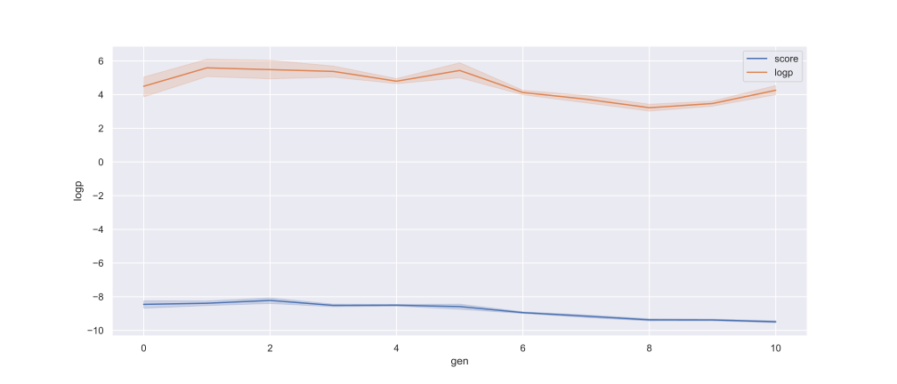
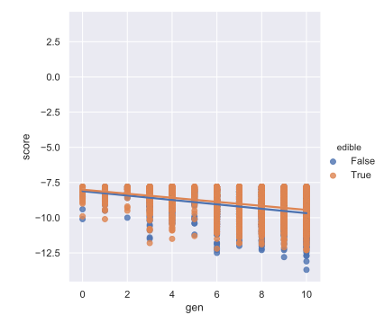
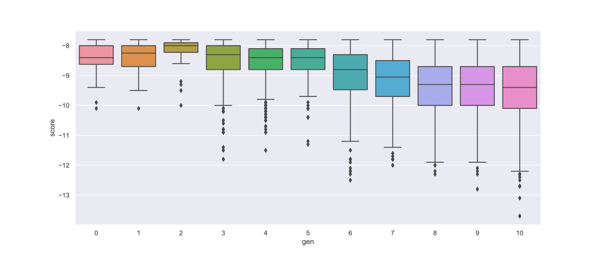
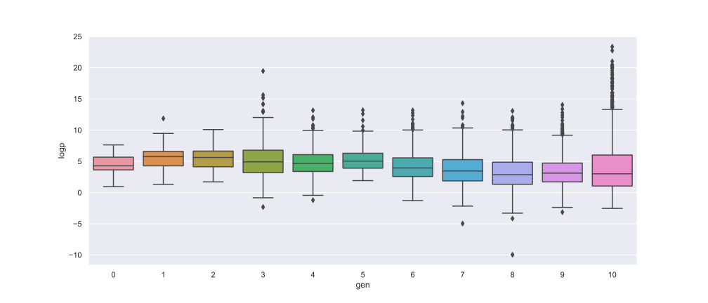
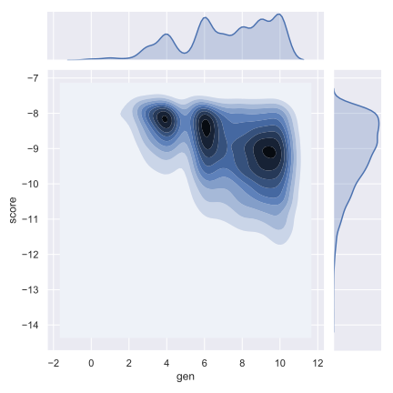

# SARS-CoV-2 Drug Discovery using Genetic Algorithm and Deep Learning

## Forkwell Coronavirus Hack: Drug Discovery
This is a submission to the [Forkwell Coronavirus Hack Competition](https://www.forkwell.io/events/forkwell-coronavirus-hack) by Forkwell under the **Drug Discovery** category.

The goal of this category is to create a novel small molecule or find existing drugs on the market that are able to stop or interfere with the coronavirus lifecyle. Therefore, one of the approaches to this is to find out the drugs/ligands that are able to bind with the [coronavirus main protease 6LU7](https://www.rcsb.org/structure/6lu7). 

Several researches and experiments have been conducted and recorded in the [DrugBank paper](https://drugbank.s3-us-west-2.amazonaws.com/assets/blog/COVID-19_Web.pdf). We then use the data to determine our evaluation target. 

Below are samples of existing drugs that have been experimented with the coronavirus binding: 

| Drugs/Ligands        | Binding Score           |
| ------------- |:-------------:|
|   Remdesivir    | -7.4 |
|   Umifenovir    | -6.1     |
|   Favipiravir | -5.6     |
|   Lopinavir | -6.6     |
|   Ritonavir | -6.2     |
|   Galidesivir | -5.6     |
|   Favipiravir | -5.6     |
|   Triazavirin | -5.9     |
|   Chloroquine | -5.6     |
|   Darunavir | -7.2     |
|   TMC-310911 | -8.9     |

# Acknowledgement
Our team would like to thank all parties, including but not limited to the forkwell coronavirus hack organizing team and mentors for giving us the chances to work on this project while contributing to the COVID-19 outbreak. 

No project is done without the support of various parties. As such, we would like to specially shoutout to the following amazing individuals:

- [**Matt O'Connor**](https://github.com/mattroconnor)\
This project is continuous progress from the repository [Deep_Learning_Coronavirus_Cure](https://github.com/mattroconnor/deep_learning_coronavirus_cure) by Matt O Connor who also happened to be our mentor in this hackathon. We would like to thank him for his extensive mentoring and open source coding.

Next, we would like to thank [**jhjensen2**](https://github.com/jensengroup) for his repository - [Graph-Based Genetic Algorithm \[GB-GA\]](https://github.com/jensengroup/GB-GA).  
The details of his work can be found in his paper - ["A graph-based genetic algorithm and generative model/Monte Carlo tree search for the exploration of chemical space"](https://pubs.rsc.org/en/content/articlelanding/2019/SC/C8SC05372C#!divAbstract).

# Team Details
Team Name: TaoFuFa
1. Quek Yao Jing - [https://github.com/Skyquek](https://github.com/Skyquek)
2. Liew Kok Fu - [https://github.com/Janson-L](https://github.com/Janson-L)
3. Tang Li Ho - [https://github.com/4036tlh](https://github.com/4036tlh)
4. Kwong Tung Nan - [https://github.com/kwongtn](https://github.com/kwongtn) 

# Requirements
The requirements are identical to the original repository [mattroconnor/Deep_Learning_Coronavirus_Cure](https://github.com/mattroconnor/deep_learning_coronavirus_cure)

## Docking
### Data Preparation
- [PyRx](https://pyrx.sourceforge.io/)

### Folder Sharding
- [Microsoft PowerShell 5.0 or above](https://docs.microsoft.com/en-us/powershell/?view=powershell-7) 

### Docking
- [Microsoft PowerShell 5.0 or above](https://docs.microsoft.com/en-us/powershell/?view=powershell-7) 
- [AutoDock Vina Binaries](http://vina.scripps.edu/), also included in the ["binding" folder](./scripts/binding).

### Conversion
- [Microsoft PowerShell 5.0 or above](https://docs.microsoft.com/en-us/powershell/?view=powershell-7) 
- [NodeJS](https://nodejs.org/en/)

# Comparisons to the Original Repositories
In this repository, we introduced a new concept - local Genetic Algorithm (local-GA), an evolutionary computing optimization method. We plan to keep things easy and simple as the [original repository](https://github.com/jensengroup/GB-GA) is well-maintained and is already ready for usage.

Our method utilizes cross-over and mutation to search for the most suitable molecule in the chemical space based on its fitness function.

We implement the local-GA in 2 areas:
1. Before Transfer Learning 
1. Before exporting the molecule to the sdf file format

This is an overview of our local-GA:
- **Population: The original molecule**\
  The initial population depends on the molecules we compute before passing it on to the local-GA. 
  The first local-GA will select of 70 molecules based on `score`, `similarity` and `logP`, together with some random selections. 
  In second local-GA, the validated molecules from the 5000 generated molecule after transfer learning is used.

- **Mating Pool: The molecules we want to pass from generation by generation**\
  We select the molecules we need from the population to the mating pool. The selection criteria is based on the fitness function. This number is also the number of molecules returned after every generation. 

- **Cross-Over: Exchange part of 2 molecules to generate 2 new Molecules**\
  The system will first randomly select 2 molecules for crossover at ring or non-ring with equal probability. If the two molecules does not have a valid structure for crossover, it will not be used.
  - If a ring structure is selected for crossover, we randomly pick one of the edges of the ring 
  - If a non-ring structure is selected for crossover, one of the single bonds (not in ring) will be selected randomly.\
We then rejoin these broken molecules and combine them to form 2 new molecules. 2 new molecules will be returned from this function.

- **Mutation: Mutate part of a molecule**\
  The molecule will undergo 7 processes separately and a random position on the molecule will be selected to do mutation by the function based on their requirements:

  - `insert_atom()`\
    A random bond will be selected and the bond type will be classified into 3 categories based on their charge: -1, -2, -3, these information are taken into consideration so that the product will have a valid chemical structure.
  - `change_bond_order()`\
    It gives the new molecule a different shape, while having the same atoms as the original.
  - `delete_cyclic_bond()`\
    One of the ring inside the molecule will be removed.
  - `add_ring()`\
    A ring will be added in a single bond between 2 molecules.
  - `delete_atom()`\
    A random ion will be removed.
  - `change_atom(mol)`\
    A random ion is selected and replaced by another molecule with the same charge as it.
  - `append_atom()`\
    An atom will be selected and the number of hydrogen atoms around it will be used to decide the type of inserted ion (if 1 then an ion with charge -1 will be used; if 2 then an ion with charge -2 will be used; etc.). The new atom will replace the hydrogen(s) and form a new molecule.

  After these 7 processes, one of them will be selected and returned if it is valid.

- **Fitness Function:** \
  The fitness function is the evaluation criteria in every generation
  The fitness function of the molecule is based on the `logP` value. According to ["LogP — Making Sense of the Value" by Sanjivanjit K. Bhal](https://www.acdlabs.com/download/app/physchem/making_sense.pdf), the oral administration of drug should be lower than `5` and best between `1.35` and `1.80`.

  `logP` is used in the pharmaceutical/biotech industries to help understand the behavior of drug molecules in the body. Drug candidates are often screened according to `logP` among other criteria, to help guide drug selection and analog optimization. This is because lipophilicity is a major determining factor in a compound’s absorption, distribution in the body, penetration across vital membranes and biological barriers, metabolism and excretion (ADME properties). According to ‘Lipinski’s Rule of 5’ (developed at Pfizer) the `logP` of a compound intended for oral administration should be `<5`. A more lipophilic compound:

  - Will have low aqueous solubility, compromising bioavailability. If an adequate concentration of a drug cannot be reached or maintained, even the most potent in-vitro substance cannot be an effective drug.
  - May be sequestered by fatty tissue and therefore difficult to excrete; in turn leading to accumulation that will impact the systemic toxicity of the substance.
  - May not be ideal for penetration through certain barriers. A drug targeting the central nervous system (CNS) should ideally have a `logP` value around `2`, for oral and intestinal absorption `1.35–1.8`, while a drug intended for sub-lingual absorption should have a `logP` value of `>5`.

  Not only does `logP` help predict the likely transport of a compound around the body. It also affects formulation, dosing, drug clearance, and toxicity. Though it is not the only determining factor in these issues, it plays a critical role in helping scientists limit the liabilities of new drug candidates.

# Approaches
## Original Approach
_According to [Deep_Learning_Coronavirus_Cure](https://github.com/mattroconnor/deep_learning_coronavirus_cure)_

Global-Generation 0:

1. LSTM-CHEM to train ChEMBL Database
1. From LSTM CHEM, we predict 10k of data
1. Check the validation
1. Compute Tanimoto similarity, select 1000 only
1. Give ID to the 1000 SMILE, add the HIV, and other drugs SMILE manually…. 
1. Save all in master table and manually check from PyRX to get the affinity

While each Global-Generation < n, 

7. From the master table (load from Global-Generation before this), we select 
  - 35 molecules based on score
  - 5 molecules based on the similarity
  - 5 molecules based on the weight
  - 5 molecules based on the random mutation
  
1) From 55, we do Transfer Learning. We then  generate 5k of data and then perform validation and similarity and generate master table. 

## Modified Approaches:
Global-Generation 0:
1. LSTM-CHEM to train ChEMBL Database
1. From LSTM CHEM, we predict 10k of data
1. Check the validation
1. Compute Tanimoto similarity, select 1000 only
1. Give ID to the 1000 SMILE, add the HIV, and others drugs SMILE manually…. 
1. Save all in master table and manually check from PyRX to get the affinity

While each Global-Generation < n, 

7. From the master table (loaded from Global-Generation), we select the molecules based on the following attributes with respect to the proportions:
    | Attribute | No of Selections (Generations 0-10) | No of Selections (In generations 11 & 12) |
    | --- | :---: | :---: |
    | Score       | 35 | 55 |
    | Similarity  | 10 | 10 |
    | log(P)      | 10 | 65 |
    | Weights     | 5  | 10 |
    | Random      | 5  | 5  |

1. We then pass the obtained molecules the to local-GA to further obtain 10 molecules that have `log(P)` of 1.35-1.80.
1. By using 90 molecules, we perform `transfer learning` to generate 5,000 molecules.
1. We then do validation on the 5000 generated molecules to discard the invalid molecules.
1. 50 extra molecules are then generated using local-GA which has a `log(P)` value of `1.35-1.8`. 
1. The 50 molecules are validated and combined with molecule from `Step 10`.
1. The molecules were then exported to the sdf file format.
1. `PyRX` was used to minimize the energy of the molecules and export the `.sdf` file into `.pdbqt` files.
1. The files were then organized into folders (depending on how many parallel sessions we want to run) using [a PowerShell script](./scripts/folderSplitter/shard.ps1).
1. Binding calculation [relevant files and configurations](./scripts/binding) were copied into each folder and the folders were distributed among our group members.
1. The output files are collected from our group members once its finished processing and compiled into a `.csv` file using [a PowerShell script](./scripts/conversion/conversion.ps1) and [a NodeJS script](./scripts/conversion/convert.js).
1. The results are interpreted and the process starts from `7` until a satisfactory result is achived or when the tester decides to stop.

# Results

1. We then pass the obtained molecules the to local-GA to further obtain 10 molecules that have `logP` of 1.35-1.80.
1. By using 90 molecule, we perform Transfer Learning and generate 5k of data.
1. From the 5k of data, we do validation to make sure it is  valid molecule. 
1. After that, we generate another 50 molecule using local-GA which has logP 1.35-1.8. 
1. Validate the 50 molecule generated using local-GA and combined with molecule from 9.
1. Export to sdf and evaluate with PyRX. Note

There are few ideas we think of improving: 
1. Change the LSTM network to Generative Adversarial Network (GAN), but after discussion we found out that its is not necessary as LSTM is good enough for this project. GAN is computing expensive and requires much more training time. 

2. From the evaluation, we plan to use neural network to perform prediction, but after we think twice we found out that the neural network is just the estimation of the affirnity which is dangerous as its contains errors in the prediction. 

# Findings and Analysis

At Generations 12, we can see 24 molecules that show some good results:

|ID  |Generation|Molecule in Smile                                                                                               |source           |weight           |logP               |score|score_best|score_avg          |similarity_to_hiv_inhibitors|similarity_to_remdesivir|
|----|---|----------------------------------------------------------------------------------------------------|-----------------|-----------------|-------------------|-----|----------|-------------------|----------------------------|------------------------|
|AAWE|12 |CC1C=CC=C(C(=O)Nc2nnnn2N2CCN(C(=O)Nc3nnnnn3)C2=O)c2ccccc2-c2ccccc2-c2ccccc2-c2ccccc21               |generated        |703.7270000000002|4.950200000000005  |-13.6|-13.6     |-12.933333333333334|0.4517169321727265          |0.6076406814661848      |
|ABQA|12 |CC1C=CC=C(C(=O)Nc2nnnn2N2CCN(C(=O)Nc3nnnnn3)C2=O)c2ccccc2C2=CC=C(C(=O)Nc3nnnnn3)C2c2ccccc2-c2ccccc21|generated        |815.7789999999997|2.3371000000000013 |-13.3|-13.3     |-12.377777777777778|0.48794306857409825         |0.6809908998988877      |
|AANY|12 |CC1CCC(C(=O)Nc2nnnn2N2CCN(C(=O)Nc3nnnnn3)C2=O)c2ccccc2-c2ccccc2-c2ccccc2-c2ccccc21                  |generated        |693.7320000000002|4.874400000000004  |-13.1|-13.1     |-11.988888888888889|0.44936439807407236         |0.5851619644723093      |
|ABFU|12 |CC1C=CCCC(C(=O)Nc2nnnn2N2CCN(C(=O)Nc3nnnnn3)C2=O)c2ccccc2-c2ccccc2-c2ccccc2C1=O                     |generated        |671.6820000000001|3.4789000000000017 |-13.0|-13.0     |-12.211111111111112|0.45617840012510985         |0.6038421599169262      |
|ABDR|12 |CC1C=CCCC(C(=O)Nc2nnnn2-c2ccccc2C2=CC=C(C(=O)Nc3nnnnn3)C2=O)c2ccccc21                               |generated        |561.5660000000003|2.3443             |-12.8|-12.8     |-11.5              |0.44492407555879365         |0.5975168132436627      |
|AAPV|11 |CC1C=CC(C(=O)Nc2nnnn2N2CCN(C(=O)Nc3nnnnn3)C2=O)c2ccccc2-c2ccccc2-c2ccccc2-c2ccccc21                 |generated        |691.7160000000001|4.650400000000004  |-12.8|-12.8     |-12.177777777777777|0.44518704490878475         |0.5804268610098907      |
|AAPM|11 |CC1C=CC(C(=O)Nc2nnnn2-c2ccccc2C2=CC=C(C(=O)Nc3nnnnn3)C2=O)c2ccccc2-c2ccccc21                        |generated        |609.6100000000002|3.2311000000000005 |-12.8|-12.8     |-11.61111111111111 |0.46226260431847693         |0.6194144838212635      |
|AAIW|12 |CC1C=CCC(C(=O)Nc2nnnn2-c2ccccc2C2=CC=C(C(=O)Nc3nnnnn3)C2=O)c2ccccc21                                |generated        |547.5390000000003|1.954199999999999  |-12.7|-12.7     |-11.488888888888889|0.44631758041361463         |0.5996892801657172      |
|ABGM|12 |CC1C=CC(C(=O)Nc2nnnn2N2CCN(C(=O)Nc3nnnnn3)C2=O)C(=O)Nc2ccccc2-c2ccccc2-c2ccccc21                    |generated        |658.6430000000001|2.454500000000001  |-12.7|-12.7     |-11.655555555555555|0.4561191762584126          |0.6072727272727273      |
|ABQM|12 |Cc1ccc(C(=O)Nc2nnnn2-c2ccccc2C2=CC=C(C(=O)Nc3nnnnn3)C2=O)c2ccccc12                                  |generated        |531.4960000000002|1.8824199999999995 |-12.6|-12.6     |-11.344444444444445|0.437743871258627           |0.575                   |
|ABZM|12 |CC1=CCCC(NC(=O)c2nnnn2N2CCN(C(=O)Nc3nnnnn3)C2=O)c2ccccc2-c2ccccc2-c2ccccc2-c2ccccc21                |generated        |705.7430000000003|4.9230000000000045 |-12.6|-12.6     |-11.899999999999999|0.46253913284608356         |0.6176470588235294      |
|ABFA|12 |CC1=CC=CCCC(C(=O)Nc2nnnn2N2CCN(C(=O)Nc3nnnnn3)C2=O)c2ccccc2-c2ccccc2-c2ccccc21                      |generated        |655.6830000000002|4.063400000000003  |-12.6|-12.6     |-12.255555555555555|0.45622126578118544         |0.6059190031152648      |
|AALZ|12 |CC1=CC=C(C(=O)Nc2nnnn2N2CCN(C(=O)Nc3nnnnn3)C2=O)c2ccccc2-c2ccccc2-c2ccccc2-c2ccccc21                |generated        |689.7000000000003|4.693800000000004  |-12.6|-12.6     |-11.833333333333334|0.44547098762435183         |0.5918261769270564      |
|AAHE|11 |CC1=CC(C(=O)Nc2nnnn2C2=CC=C(C(=O)Nc3nnnnn3)C2=O)c2ccccc2-c2ccccc2-c2ccccc2-c2ccccc21                |generated        |671.6810000000003|4.777000000000003  |-12.3|-12.3     |-11.844444444444445|0.4490997158054172          |0.607621009268795       |
|ABPU|11 |Cc1ccc2c(c1)-c1ccccc1-c1ccccc1C(C)C=CC(C(=O)Nc1nnnn1N1CCC(C(=O)Nc3nnnnn3)C1=O)c1ccccc1-2            |generated        |704.7549999999999|4.476320000000002  |-12.3|-12.3     |-11.355555555555554|0.43659932565872095         |0.5651027938850817      |
|ABSQ|12 |CC1C=CCCC(C(=O)Nc2nnnn2-c2nnnn2N2CCN(C(=O)Nc3nnnnn3)C2=O)c2ccccc21                                  |generated        |559.5150000000003|-0.5946999999999969|-12.3|-12.3     |-10.38888888888889 |0.45925312984410877         |0.6104500775995861      |
|AABM|12 |CC=CCNc1nnnn1-c1ccccc1                                                                              |genetic_algorithm|215.26           |1.6503             |-12.3|-12.3     |-10.97777777777778 |0.19191909320789163         |0.21226142278773857     |
|AABY|12 |CC1=CCC=C(C(=O)Nc2nnnn2N2CCN(C(=O)Nc3nnnnn3)C2=O)c2ccccc2-c2ccccc21                                 |generated        |551.5310000000002|1.7498999999999996 |-12.2|-12.2     |-11.677777777777777|0.43970133727850114         |0.5669781931464174      |
|AATK|12 |CC1C=CCCC(C(=O)Nc2nnnn2N2CCN(C(=O)Nc3nnnnn3)C2=O)c2ccccc2-c2ccccc2-c2ccccc21                        |generated        |643.6720000000001|3.7636000000000016 |-12.2|-12.2     |-10.877777777777778|0.45306540731465034         |0.5918792295679334      |
|ABXM|11 |C#CC1=CCCC(C(=O)Nc2nnnn2N2CCN(C(=O)Nc3nnnnn3)C2=O)c2ccccc2-c2ccccc2-c2ccccc21                       |generated        |639.6400000000002|3.1205000000000025 |-12.2|-12.2     |-11.5              |0.46206146930756264         |0.6192946058091287      |
|AAXS|12 |Cc1ccc(-n2nnnc2NC(=O)C2C=CC(C)c3ccccc3-c3ccccc3NC2=O)c(=O)n1C(=O)Nc1nnnnn1                          |generated        |605.5790000000002|1.7213199999999989 |-12.1|-12.1     |-11.399999999999999|0.4618841020546573          |0.6360332294911735      |
|AACW|12 |CC1C=CCCC(C(=O)Nc2nnnn2C2=CC=C(C(=O)Nc3nnnnn3)C2=O)c2ccccc2-c2ccccc2-c2ccccc21                      |generated        |637.6640000000002|4.146600000000002  |-12.1|-12.1     |-11.533333333333333|0.44573238812562777         |0.5976116303219107      |
|AABM|12 |CC=CCNc1nnnn1-c1ccccc1                                                                              |genetic_algorithm|215.26           |1.6503             |-12.3|-6.7      |-5.7555555555555555|0.19191909320789163         |0.21226142278773857     |

 

## Below shows some data visualization of the generation from gen 0 to gen 12:

  

  The score converge from -8.5 in generation 0 to -10 and below which is a good sign.

  

  The trend of logP and score is going down which show that our hypothesis is correct.

  

  The graph show that the trend of logP < 5(Edible) are going down which indicate that we will get better and better results in later generations.

  

  We can see that the coverage of score is getting wier and wider from generation to generation. 

  

  We can see that the coverage of logP is getting wider and wider from generation to generation.  

  

  The width of the violin plot is getting smaller and smaller throught the generation.

  

  The graphs show a lot of data generated have score around -7.5 to -9.

 
 

# Challenges Faced
We face the challenge of loading the chemical data into the PyRX and compute the binding affirnity. This process is time consuming. 1.5 of data requires 12 hours of training.............JANSON & KWONG

# Future work
Evaluation: 
1) Cloud Computing: ...................KWONG
2) .....JANSON or KWONG (add what method which can speed up the progress)

# Reference
1. https://drugbank.s3-us-west-2.amazonaws.com/assets/blog/COVID-19_Web.pdf
1. https://www.acdlabs.com/download/app/physchem/making_sense.pdf
1. https://github.com/mattroconnor/deep_learning_coronavirus_cure
1. https://github.com/isayev/ReLeaSE
1. https://github.com/sirimullalab/dlscore
1. https://gitlab.com/cheminfIBB/pafnucy
1. https://github.com/jensengroup/GB-GA
1. https://github.com/jensengroup/GB-GM
1. https://chemrxiv.org/articles/Graph-based_Genetic_Algorithm_and_Generative_Model_Monte_Carlo_Tree_Search_for_the_Exploration_of_Chemical_Space/7240751
1. https://www.ncbi.nlm.nih.gov/pmc/articles/PMC6198856/
1. https://arxiv.org/abs/1703.10603

# License

This project is licensed under the MIT License: <http://opensource.org/licenses/MIT>\
Copyright &copy; 2020 [Quek Yao Jing](https://github.com/Skyquek), [Liew Kok Fu](https://github.com/Janson-L), [Tang Li Ho](https://github.com/4036tlh), [Kwong Tung Nan](https://github.com/kwongtn) 

Permission is hereby granted, free of charge, to any person obtaining a copy of this software and associated documentation files (the “Software”), to deal in the Software without restriction, including without limitation the rights to use, copy, modify, merge, publish, distribute, sublicense, and/or sell copies of the Software, and to permit persons to whom the Software is furnished to do so, subject to the following conditions:

The above copyright notice and this permission notice shall be included in all copies or substantial portions of the Software.

THE SOFTWARE IS PROVIDED “AS IS”, WITHOUT WARRANTY OF ANY KIND, EXPRESS OR IMPLIED, INCLUDING BUT NOT LIMITED TO THE WARRANTIES OF MERCHANTABILITY, FITNESS FOR A PARTICULAR PURPOSE AND NONINFRINGEMENT. IN NO EVENT SHALL THE AUTHORS OR COPYRIGHT HOLDERS BE LIABLE FOR ANY CLAIM, DAMAGES OR OTHER LIABILITY, WHETHER IN AN ACTION OF CONTRACT, TORT OR OTHERWISE, ARISING FROM, OUT OF OR IN CONNECTION WITH THE SOFTWARE OR THE USE OR OTHER DEALINGS IN THE SOFTWARE.

* * *

This tool contains code from "PENDING INSERTION" from XXXX which is licensed under the [MIT License](http://opensource.org/licenses/MIT) (see above).   
Copyright &copy; XXXX-XXXX [XXXX](XXXX) , \<email>

